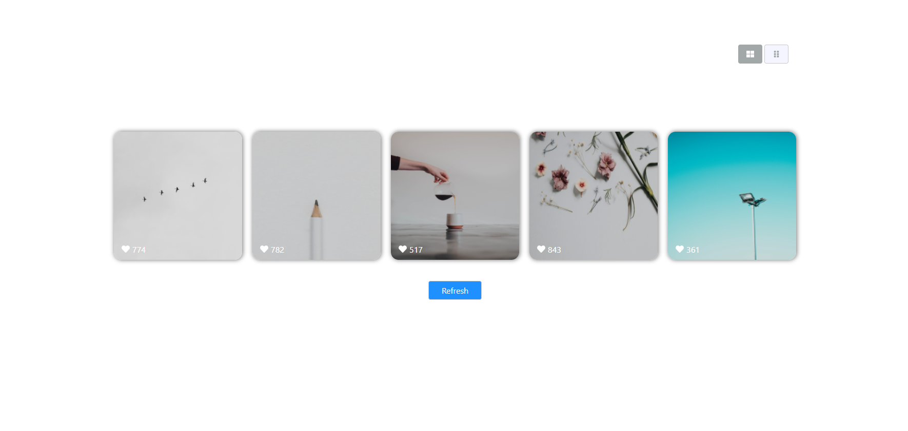
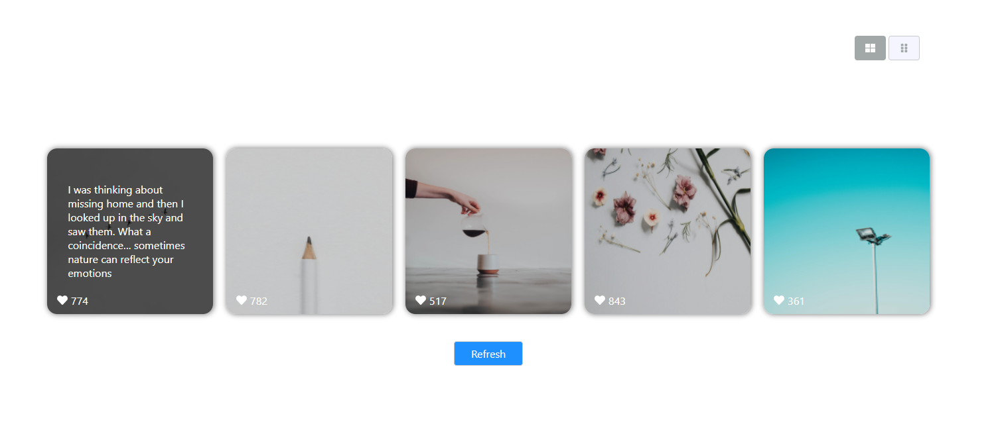
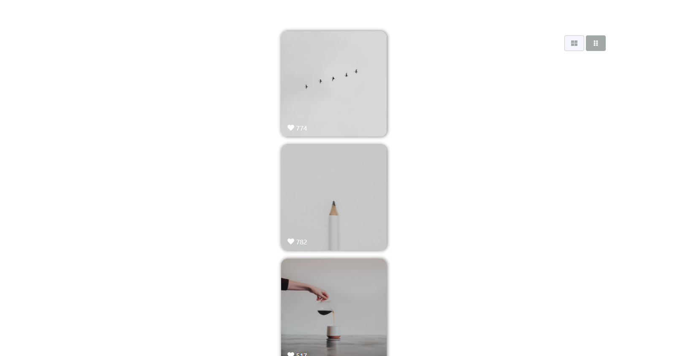
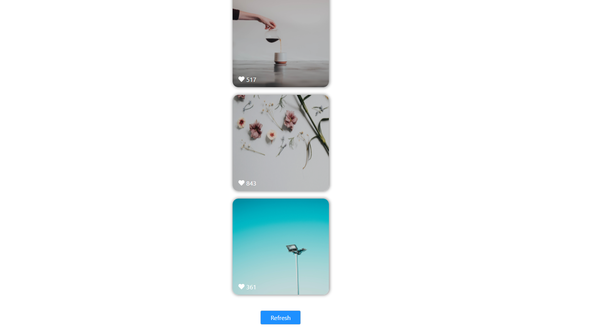

# Getting Started

In the project directory, you can run:
### `npm install` for the first time. 

### `npm start`

Runs the app in the development mode.\
Open [http://localhost:3000](http://localhost:3000) to view it in the browser.

The page will reload if you make edits.\
You will also see any lint errors in the console.

# Assumptions:

* I chose to use redux & redux-thunk,
  Due to the limited time I had, that was not enough to give me the confidence to experience things I was less touched by.
  Also, the love to used in redux-thunk that allows me to write the code cleaner on the components side.
  
* I had a some difficult time dealing with some issue on CSS, perhaps from the pressure, and decided to implement the components in this structure.
  
* I finished the task in 4 hours, so I let off the unit-tests for now.
  
* I add the delayed component to loading interactive text when images not have shown in 1.5s
  
* I notice the url give me about 200 images, so I decided to build cache mechanism for these images that will expired in every 5 minutes.
  
* I added a consts file that defined that all my consts, but in future features I think to push some consts to dot env file.
  
* I tried to stick to the screenshots as much as possible
  

#Future features/planning:
* SASS - add node-sass to compile scss into css files.
* dot.env - add dot env file per environment 
* webpack/gulp - add this to compile all react code into one bundle minify js file and resources.
* jest - add unit tests for logic functions like:  getRandomImages, cacheDataIsUpToDate, fetchImagesFromAPI,
* component tests - add tests on components to check if they look like as defined on the spec.

Hope the mission will satisfy you, I'm not sure how much can really be accomplished in just 3 hours :-/

###Author: Hadriel Benjo

###screenshot 

